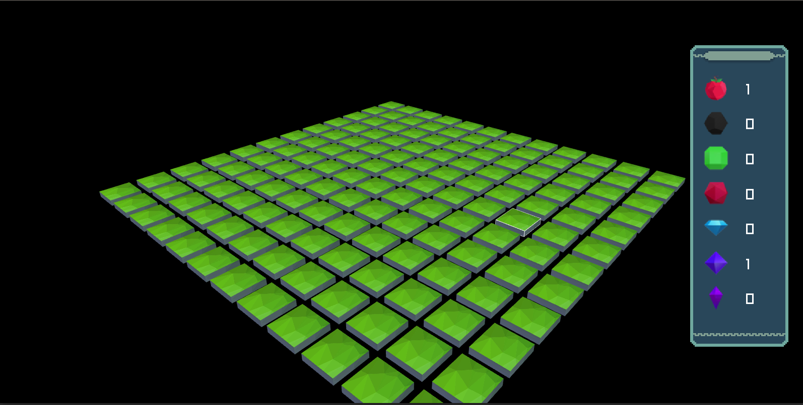
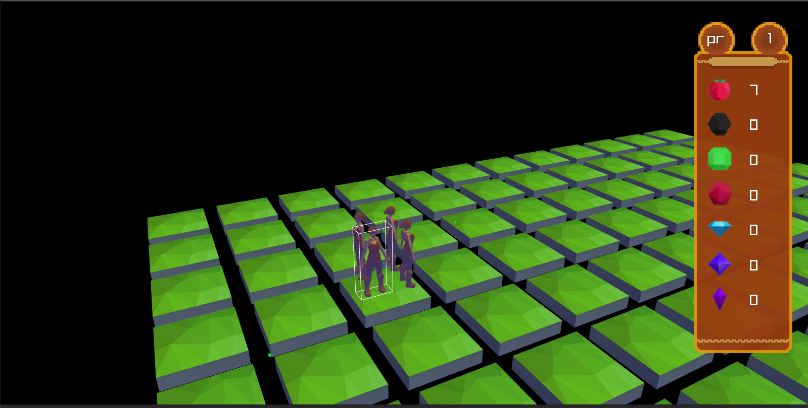
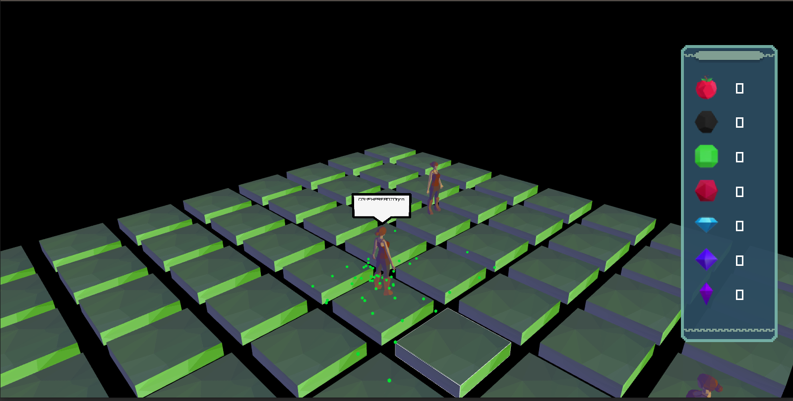
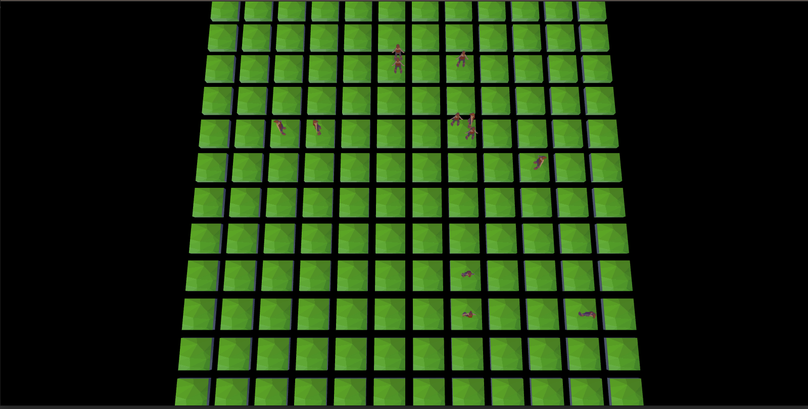

# Zappy - Epitech Year-end Project

This project was realized in the context of the second year of Epitech Technology.
The goal was to apply competencies learned throughout the year to create a network video game.

This project consists in a video game where multiple artifical intelligences compete to amass ressources and consume those ressources to attain a level-up through rituals.
The AI may reproduce themselves, take and drop ressources, broadcast informations and initiate a ritual.
The winner is the first team to have all its members reach level 8.

To do so, this project is divided into three parts :
- A server, generating the world and handling the AI commands
- A graphical client (GUI) displaying the current state of the players
- An artificial intelligence competing in the game to reach the maximum level.

Each parts had different goals :
- The server, to perfectly handle the world and its players as well as sending and receiving informations through the network.
- The GUI, to be ergonomic and easy to comprehend. The artistic originality and the realism of the graphics were also important evaluation criteria
- The AI, to be capable of surpassing other players and adaptat to its environment in order to optimize its win rate.

## Usage

```sh
USAGE: ./zappy_server -p port -x width -y height -n name1 name2 ... -c clientsNb -f freq --auto-start on|off --display-eggs true|false
	port		is the port number
	width		is the width of the world
	height		is the height of the world
	nameX		is the name of the team X
	clientsNb	is the number of authorized clients per team
	freq		is the reciprocal of time unit for execution of actions
	auto-start	does the greeting is send automaticly #(see bonus part)
	display-eggs	eggs are visible and destructible
```
```sh
USAGE: ./zappy_gui -p port -h machine
    port    is the port number
    machine is the name of the machine; localhost by default
```
```sh
USAGE: ./zappy_ai -p port -n name -h machine
    port    is the port number
    name    is the name of the team
    machine is the name of the machine; localhost by default
```

## Informations

### Teams

n the beginning of the game, a team has n slot available (represented on the board by an egg waiting for a
client to connect).
Each player is driven by a client.
The clients cannot communicate or exchange data outside of the game (no matter what it is it should be
passed via the server).
In the beginning, the player has 10 life units, which means they can survive for 1260 time units, or 1260 / f seconds.

### Commands

Each player responds to the following actions and only to these ones, with the following syntax :

|            Action            |       Command      | Time limit |                 Response                 |
|:----------------------------:|:------------------:|:----------:|:----------------------------------------:|
|       move up one tile       |     __Forward__    |     7/f    |                    ok                    |
|        turn 90° right        |      __Right__     |     7/f    |                    ok                    |
|         turn 90° left        |      __Left__      |     7/f    |                    ok                    |
|          look around         |      __Look__      |     7/f    |            [tile1, tile2,...]            |
|           inventory          |    __Inventory__   |     1/f    |        [linemate n, sibur n, ...]        |
|        broadcast text        | __Broadcast text__ |     7/f    |                    ok                    |
|  number of team unused slots |   __Connect_nbr__  |      -     |                   value                  |
|         fork a player        |      __Fork__      |    42/f    |                    ok                    |
| eject players from this tile |      __Eject__     |     7/f    |                   ok/ko                  |
|       death of a player      |         _-_        |      -     |                   dead                   |
|         fork a player        |      __Fork__      |    42/f    |                    ok                    |
|          take object         |   __Take object__  |     7/f    |                   ok/ko                  |
|        set object down       |   __Set object__   |     7/f    |                   ok/ko                  |
|       start incantation      |   __Incantation__  |    300/f   | Elevation underway | Current level: k/ko |

### Player reproduction

A player can reproduce thanks to the **fork** command.
The execution of this command leads to the production of an egg.
Once it’s layed, the player who has layed it can take care of their business.
Once the egg is layed, a new slot is added to the team.

> This operation authorizes a new client to be connected.

The **connect_nbr** command sends back the number of connections that are underway and authorized for
this family.

### Egg hatching

When a client connects to a free slot of their team an available egg from the team is selected randomly.
The selected egg then hatch and the newly spawned player starts with a random direction.

### Broadcast

To emit a message, the client must send the following command to the server:
```
Broadcast text\n
```

The server will then send the following line to all of its clients:
```
message K, text\n
```
where **K** is the tile where the sound is coming from.

### Ejection

A player can eject all other players from a shared unit of terrain by pushing them in the direction it is looking. \
When a client send the eject command to the server, all of the clients that are sharing the tile will receive
the following line:
```
eject : K\n
```
where K is the direction of the tile where the pushed player is coming from. \
When a player eject all other being from the unit of terrain it also destroy any eggs layed on that unit.

### Incantations

This ritual, which augments physical and mental capacities, must be done according to a particular rite: \
they must gather the following on the same unit of terrain:

- At least a certain number of each stones
- At least a certain number of players with the same level

The elevation begins as soon as a player initiates the incantation. \
The player who start an incantation will receive ko if all the requirements are not satisfied and the incantation will be canceled, which means that it will make the next action received by the server.

It is not necessary for the players to be on the same team; they only need to be of the same level. \
Every player with the corresponding level and present at the beginning of the incantation attain the higher level.

During the incantation, the participants can not make any action until the end of the rite.

| elevation | nb of players | linemate | deraumere | sibur | mendiane | phiras | thystame |
|:---------:|:-------------:|:--------:|:---------:|:-----:|:--------:|:------:|:--------:|
|  1 -> 2   |       1       |     1    |     0     |   0   |     0    |    0   |     0    |
|  2 -> 3   |       2       |     1    |     1     |   1   |     0    |    0   |     0    |
|  3 -> 4   |       2       |     2    |     0     |   1   |     0    |    2   |     0    |
|  4 -> 5   |       4       |     1    |     1     |   2   |     0    |    1   |     0    |
|  5 -> 6   |       4       |     1    |     2     |   1   |     3    |    0   |     0    |
|  6 -> 7   |       6       |     1    |     2     |   3   |     0    |    1   |     0    |
|  7 -> 8   |       6       |     2    |     2     |   2   |     2    |    2   |     1    |

At the end of the incantation, the exact quantity of resources needed by the rite are consumed.

## Screenshots





